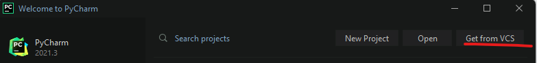

## Установка
Клонируем репозиторий (возможно необходимо будет связать профиль на GitHub с PyCharm):



После загрузки устанавливаем интерпретатор:  


Далее нужно активировать среду с помощью команды ```.\venv\Scripts\activate```:  


Вводим по очереди в терминале для установки:
```
pip install tensorflow
pip install opencv-python
pip install keras
pip install imageai
```
### Скачать предварительную модель [yolov3](https://github.com/OlafenwaMoses/ImageAI/releases/download/essential-v4/pretrained-yolov3.h5)
Сохранить ее в корне проекта


## Работа
### 1:
Фото и аннотации необходимо сохранить в папке ```Data``` в следующем виде:   

### 2:
Проверить что в ```object_names_array``` указанны все необходимые объекты:   

### 3:
Запустить ```main.py```